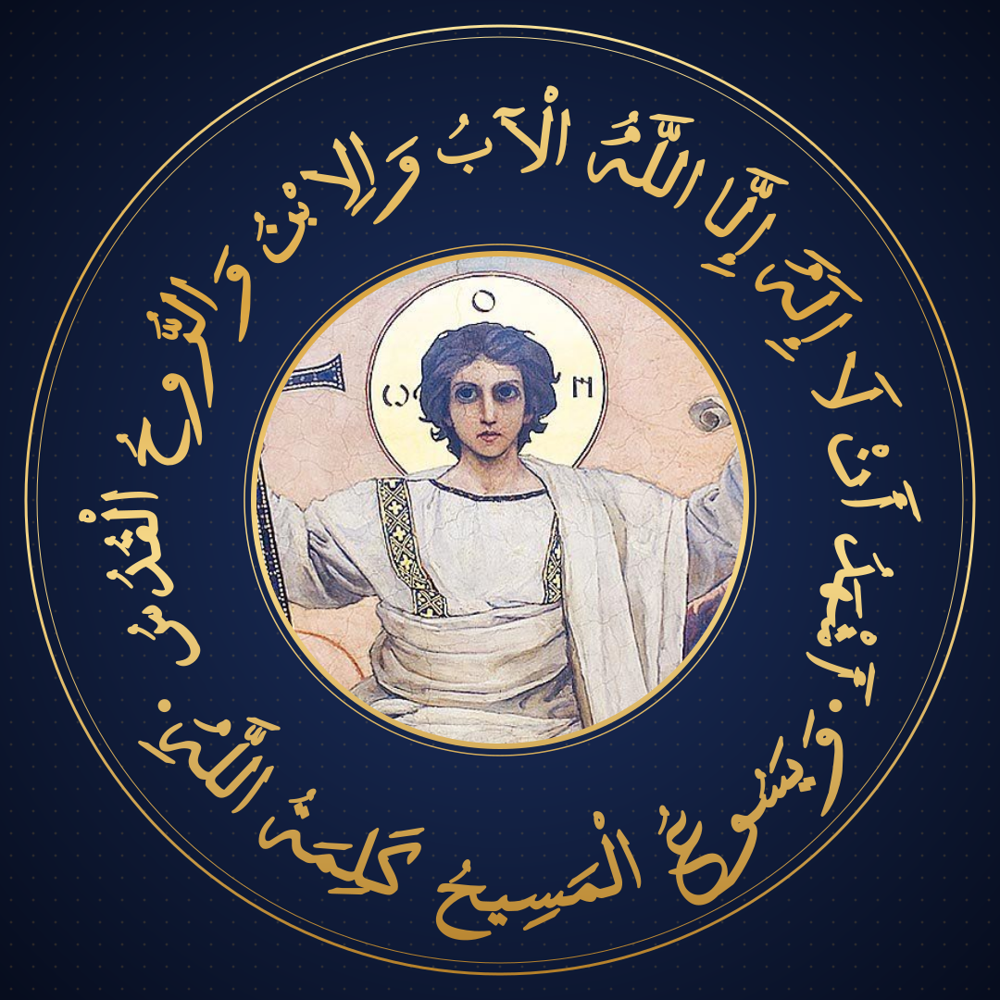
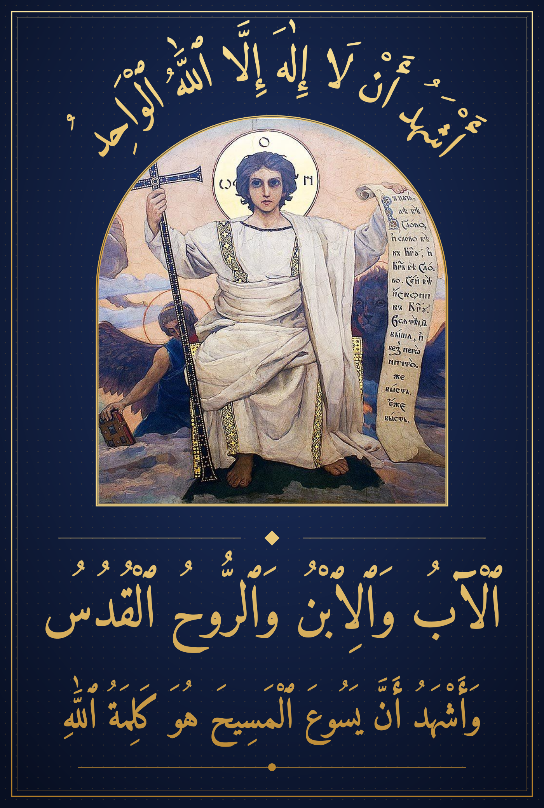

# Orthodox Shahada — Thuluth

**Profile picture (1:1, WhatsApp-circle safe):** `pfp.png`, built by `python3 pfp.py`, set in
**ae_Tholoth**, a real Thuluth font (Arabeyes, GPL with font-embedding exception;
Debian `fonts-arabeyes`). ae_Tholoth has no wasla or dagger-alif glyphs, so `pfp.py` switches to
the standard modern fully-voweled spelling (ا, إِلَهَ, اللَّهُ). Pass any other font path as the
first argument.



---

The portrait below was the first attempt (Amiri, Naskh):



```
أَشْهَدُ أَنْ لَا إِلٰهَ إِلَّا ٱللَّٰهُ ٱلْوَاحِدُ
ٱلْآبُ وَٱلِٱبْنُ وَٱلرُّوحُ ٱلْقُدُسُ
وَأَشْهَدُ أَنَّ يَسُوعَ ٱلْمَسِيحَ هُوَ كَلِمَةُ ٱللَّٰهِ
```

*I bear witness that there is no god but the One God — the Father, the Son and the Holy Spirit —
and I bear witness that Jesus the Christ is the Word of God.*

The last line answers the painting: Viktor Vasnetsov's *The Word* (St Volodymyr's Cathedral, Kyiv;
public domain). The scroll it holds is John 1:1 in Church Slavonic, «В начале бе Слово…».

## How it's built

`compose.py` is a small composition engine. Nothing is a raster font render: every letter body
and every tashkeel mark becomes its own vector path, and each one passes through a chain of
plain `(x, y) → (x, y)` functions:

| Step | Math |
| --- | --- |
| Shaping | HarfBuzz joins letters and positions marks with the font's GPOS anchors |
| Per-glyph tweak | rotate by θ about the glyph's centre, scale by s, then translate by (dx, dy) |
| Thuluth ascender warp | $y' = h_0 + k\,(y-h_0)$ for $y>h_0$ (with $h_0=430$, $k=1.45$): tall alifs and lāms, bowls untouched |
| Marks | rigid lift by $\text{tall}(y_{\min}) - y_{\min}$, then scaled ×1.12, so a mark rides the stretched stem without distorting |
| Crown line | circular warp $\theta = x/R,\ r = R + y$, giving the point $(c_x + r\sin\theta,\ c_y - r\cos\theta)$, applied to every outline point so joins stay seamless along the arch |
| Lower tiers | affine fit to a fixed width |

## Use

```bash
pip install fonttools uharfbuzz cairosvg
python3 compose.py            # → orthodox-shahada-thuluth.{svg,png}
python3 compose.py --debug    # → same, with every glyph labelled (red = letter, cyan = mark)
```

To move one piece, find its label in the debug render and put it in `tweaks.json`. Keys are
`tier:index` (`crown`, `trinity`, `word`). Units are font units (1000 per em):

```json
{ "crown:3": {"dy": 40}, "trinity:0": {"scale": 1.2}, "word:12": {"dx": -30, "rot": -8} }
```

To change the text, the arc span or the tiers, edit `TIERS` in `compose.py`. `H0` and `K`
control how Thuluth-tall the ascenders are.

## Font

Amiri Quran (SIL OFL, `fonts/OFL.txt`). It's the open font with the most complete Qur'anic-grade
tashkeel: wasla, dagger alif, shadda stacks. No open-licensed font has *true* Thuluth
letterforms with working mark positioning. That's why the Thuluth traits (tall ascenders, weight,
arc and tier composition) are added with math on top. `shape.py` works with any OpenType font,
so if you own a real Thuluth font (e.g. DecoType Thuluth), point `FONT` at it and the whole
pipeline still applies.

Found along the way:
[abdulmanan69/qalam-studio](https://github.com/abdulmanan69/qalam-studio), a browser editor
(MIT) where you can drag every letter, dot and haraka by hand. Its "Thuluth" style also uses
Amiri Quran.
[Layla Thuluth](https://fontlibrary.org/en/font/layla-thuluth) (OFL) has real Thuluth shapes, but
it has no GPOS table, so it can't place tashkeel.
